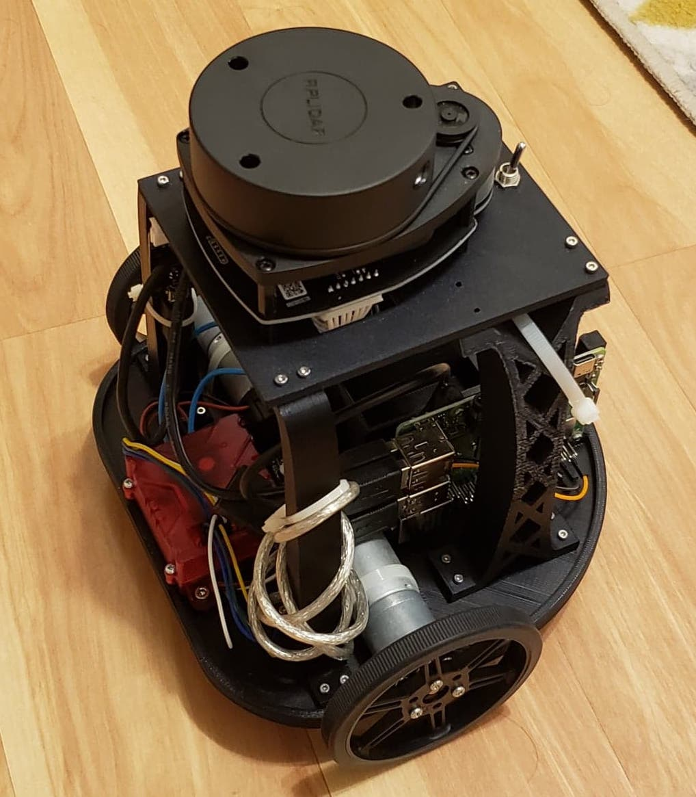
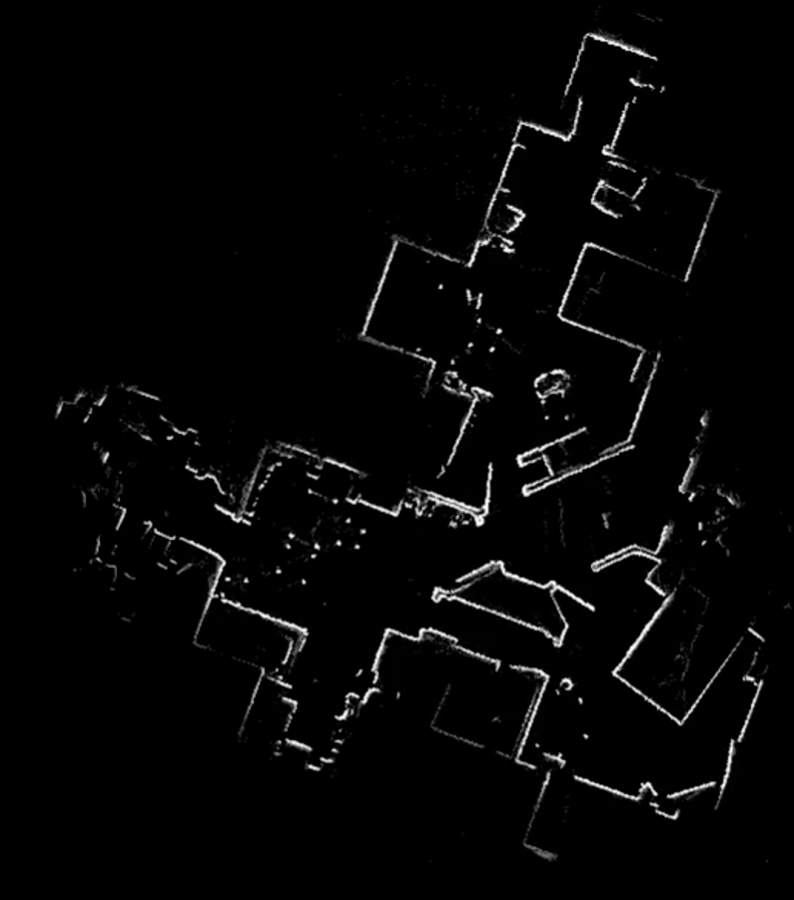
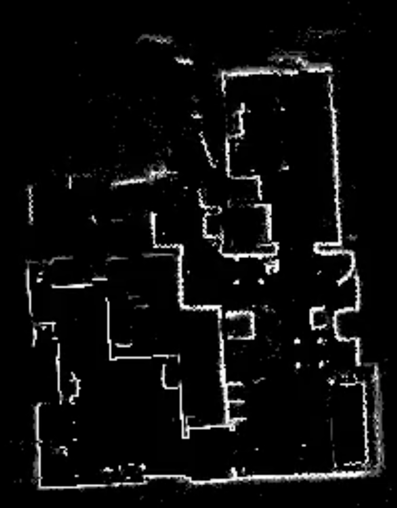
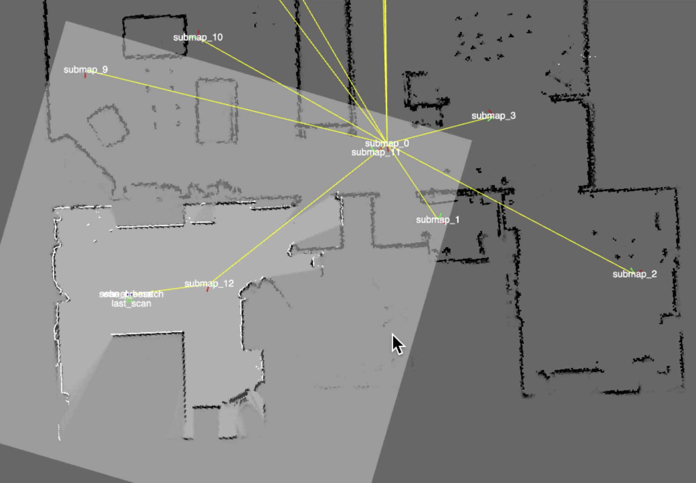
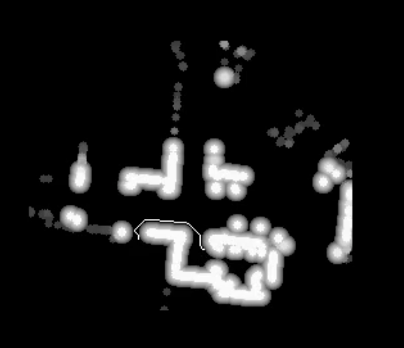

# Mapping Robot
This is a personal to learn about SLAM (and have fun!). It is largely based on the [Google Cartographer](https://static.googleusercontent.com/media/research.google.com/en//pubs/archive/45466.pdf) system with some modifications to make it less computationally expensive. Mapping can be teleoperated or autonomous with Dijkstra's algorithm computing a path to the nearest unseen map location, and a local planner following said path using the dynamic window approach.
Here's a picture of my robot:

It uses an RPLidar A1 along with basic wheel encoders, powered by a Raspberry Pi 4.

## Demos
Screenshots of maps generated are shown below, with a resolution of 3cm.

  

The first two maps are approximately the same size, while the third is much smaller. All are taken inside houses with teleoperation, generated in real-time.

I use webviz to visualize operation during runtime, below is a screenshot showing this

### Video
For a video of the generation of the first map above, visit [this link](https://drive.google.com/file/d/13C1aurzlZVfCNlEuwEI1vrgi6UoBJ2Nx/view?usp=sharing). White dots are scan points, and any sharp jiggling is a relic of visualization lag, not the actual scan pose used. The sensor data is played back for mapping to be performed at 2x speed, showing the system's real-time capabilities. The visualization shows transformations between submap frames, along with the current coordinate frames of the last scan taken by the robot and the latest pose estimate.

While watching notice how the map is misaligned at the very end (4:40 in the video), but a loop closure on the last submap largely fixes this.

## System overview
The software uses ROS. Explore the launch/exploration.launch file to see a list of nodes in the repository. There four main parts of the system, loosely corresonding to ROS nodes.
### Scan rectification
Low speed laser scans (7hz) means there is significant warping due to robot motion. So, the first step is unwarping scans by interpolating between estimated robot poses given by wheel encoder odometry. 
### Scan matching
Just like in cartographer, this node integrates wheel encoders as an initial pose estimate, then refines the pose by matching the latest laser scan to the current submap. It tries to detect tracking loss (because of sharp wheel slip, usually caused by collisions or large bumps) and create new submaps on these events. Otherwise, new submaps are created when the robot has driven a certain distance away from the center of the previous one (5m currently used).

When new submaps are created, the old ones are frozen and never changed (this is different from the original cartographer) and passed on to the loop closure and exploration nodes.
### Loop closure
A separate node accumulates all previously frozen submaps and periodically attempts to find loop closures to past submaps. It searches in a wider range (around 2m, 30deg) in the submap whose centroid is closest to the current estimated robot pose.
### Exploration
#### Global planner
The global planner uses dijktra's algorithm to plan a least-cost path from the current map coordinate to any unobserved coordinate. The "global map" is actually all past submaps along with the current submap overlayed on top of each other. To make computation efficient, global map values are lazily evaluated when queried by the planner. Maps are inflated with the radius of the robot before planning, along with a buffer of decaying cost to encourage safe routes.
A visualization of the inflated map is below, along with a thin white drawing of the current path

#### Local planner
The local planner uses a cheap implementation of [DWA](http://www4.cs.umanitoba.ca/~jacky/Teaching/Courses/74.795-LocalVision/ReadingList/fox97dynamic.pdf) to follow the planned path while avoiding detected laser scan points. It does not consider the costmap, only penalizing trajectories for driving close to currently detected scan points.
